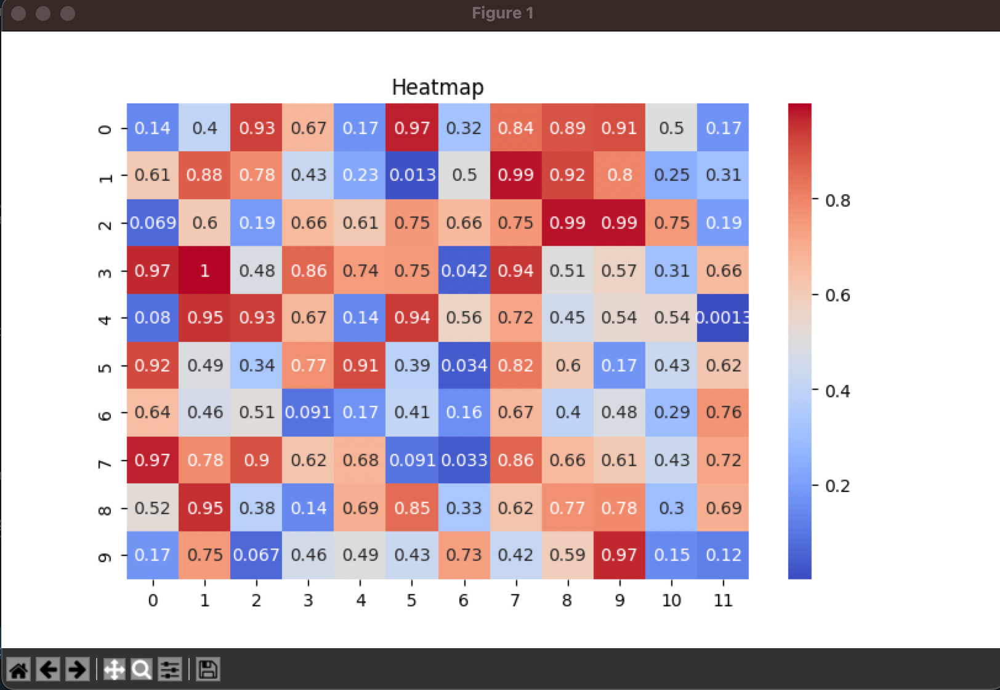

#### Computer Vision Research Assistant Work | Yolov8 | Yolov9 | OpenCV | LabelImg 

<a href = "../">Back to Main List  

<h3>Plots💡</h3>

<h4>When to use when Plots, with basic plot generating code</h4>
<h5>Details</h5>
<table width="100%" style="width: 100%">
    <tr>
        <th>Plot</th>
        <th>Image</th>
        <th>Use When</th>
        <th>Example</th>
    </tr>
    <tr>
        <td>1. Scatter Plot</td>
        <td> </td>
        <td>You have two continuous variables and want to show the relationship between them.</td>
        <td>Plotting time vs cells from a dataset.</td>
    </tr>
    <tr>
        <td>2. Line Plot</td>
        <td> </td>
        <td>You have data points ordered in time (or any other continuous variable), and you want to show trends or changes.</td>
        <td>Plotting time vs cells.</td>
    </tr>
    <tr>
        <td>3. Bar Plot</td>
        <td> </td>
        <td>You have categorical data and you want to compare quantities across categories.</td>
        <td>Plotting sales in different categories.</td>
    </tr>
    <tr>
        <td>4. Histogram</td>
        <td> </td>
        <td>You have continuous data and want to visualize the distribution (frequency) of the data.</td>
        <td>Plotting the distribution of cells.</td>
    </tr>
    <tr>
        <td>5. Box Plot</td>
        <td> </td>
        <td>You want to display the distribution of data based on a five-number summary (minimum, first quartile, median, third quartile, and maximum), and identify outliers.</td>
        <td>Showing the distribution of cells.</td>
    </tr>
    <tr>
        <td>6. Pie Chart</td>
        <td> </td>
        <td>You want to show proportions of a whole.</td>
        <td>Showing the percentage distribution of sales categories.</td>
    </tr>
    <tr>
        <td>7. Heatmap</td>
        <td> </td>
        <td>You want to visualize matrix data (e.g., correlation matrix or any data with two dimensions).</td>
        <td>Creating a heatmap from a correlation matrix.</td>
    </tr>
    <tr>
        <td>8. Violin Plot</td>
        <td> </td>
        <td>You want to show the distribution of data across several categories, combining aspects of a box plot and a density plot.</td>
        <td>Visualizing cells distribution by categories.</td>
    </tr>
    <tr>
        <td>9. Area Plot</td>
        <td> </td>
        <td>You want to show how a quantity changes over time, with the area between the line and the x-axis filled.</td>
        <td>Plotting time vs cells.</td>
    </tr>
    <tr>
        <td>10. Pair Plot</td>
        <td> </td>
        <td>You want to visualize the relationships between multiple variables in a dataset.</td>
        <td>Creating a pair plot from a dataset with multiple features.</td>
    </tr>
    <tr>
        <td>11. Stacked Bar Plot</td>
        <td> </td>
        <td>You want to show how individual parts contribute to the whole across categories.</td>
        <td>Showing the total sales by category and how each subcategory contributes.</td>
    </tr>
    <tr>
        <td>12. 3D Plot</td>
        <td> </td>
        <td>You want to visualize 3D data.</td>
        <td>Plotting 3D points.</td>
    </tr>
<tr>
        <td>13. Contour Plot</td>
        <td> </td>
        <td>You want to show the level sets of a function or a 2D density plot.</td>
        <td>Visualizing a mathematical function in 2D.</td>
    </tr>
</table>
