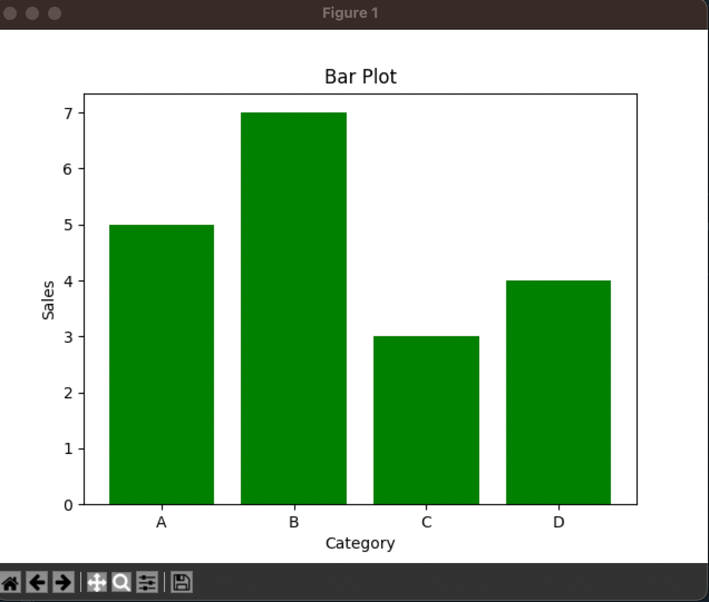

#### Computer Vision Research Assistant Work | Yolov8 | Yolov9 | OpenCV | LabelImg 

<a href = "../">Back to Main List  

<h3>Plots💡</h3>

<h4>When to use when Plots, with basic plot generating code</h4>
<h5>Details</h5>
<table width="100%" style="width: 100%">
    <tr>
        <th>Plot</th>
        <th>Image</th>
        <th>Use When</th>
        <th>Example</th>
    </tr>
    <tr>
        <td>1. Scatter Plot</td>
        <td> </td>
        <td>You have two continuous variables and want to show the relationship between them.</td>
        <td>Plotting time vs cells from a dataset.</td>
    </tr>
    <tr>
        <td>2. Line Plot</td>
        <td> </td>
        <td>You have data points ordered in time (or any other continuous variable), and you want to show trends or changes.</td>
        <td>Plotting time vs cells.</td>
    </tr>
    <tr>
        <td>3. Bar Plot</td>
        <td> </td>
        <td>You have categorical data and you want to compare quantities across categories.</td>
        <td>Plotting sales in different categories.</td>
    </tr>
    <tr>
        <td>4. Histogram</td>
        <td> </td>
        <td>You have continuous data and want to visualize the distribution (frequency) of the data.</td>
        <td>Plotting the distribution of cells.</td>
    </tr>
</table>
